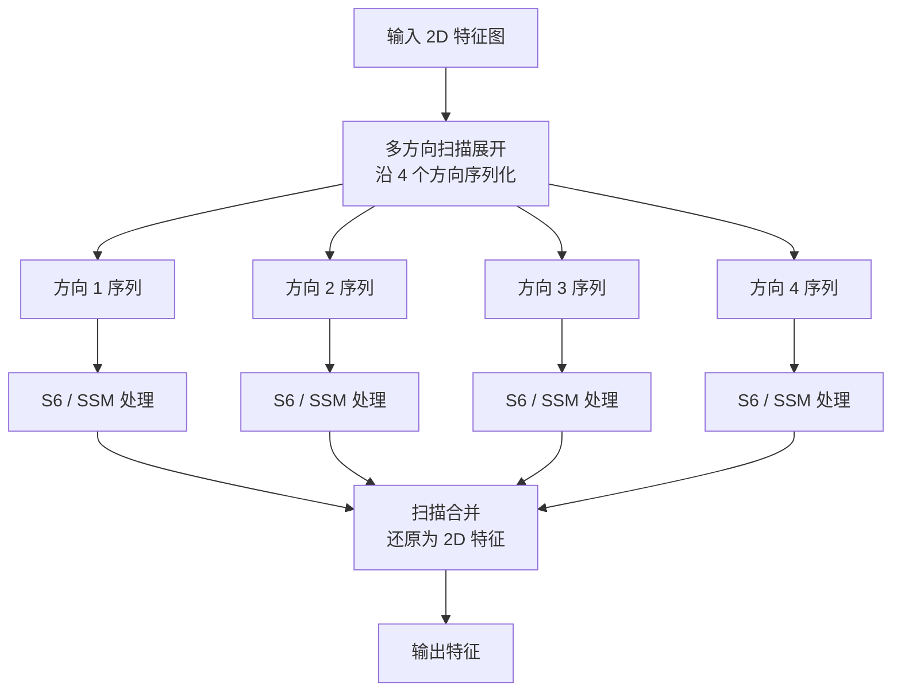

# VSSLayer & VSSBlock 学习笔记

> 目的：整理 VMamba/Vision State Space (VSS) 中 VSSLayer 与 VSSBlock 的核心机制，明确其设计动机、实现路径、数学表达及落地价值，方便在后续的模型对比与笔记编写中快速引用。

---

## 1. 设计初心与意义
- **解决问题**：Transformer 自注意力在高分辨率图像上复杂度为 `O(N²)`，内存和算力消耗巨大；经典状态空间模型（SSM）难以直接处理二维特征。
- **核心创新**：VSSBlock 引入 **二维选择性扫描（Selective Scan 2D, SS2D）**，通过多方向扫描 + 状态空间卷积实现全局上下文捕获，同时保持 **线性复杂度 `O(N)`**。
- **应用价值**：在医学分割、遥感、细粒度检测等对长程依赖/高分辨率敏感的任务中，兼顾 CNN 的局部表达与 Transformer 级别的全局语义。

建议补图：
- VSSBlock 双分支结构示意（可参考论文中的 Figure 4，说明两路特征如何汇合）。
- SS2D 扫描示意（四方向展开→S6→合并流程，可用下方 Mermaid 图或重新绘制）。

---

## 2. VSSBlock 核心结构

| 分支 | 核心组件 | 主要功能 | 处理流程 |
| --- | --- | --- | --- |
| **主分支** | 线性层 → 深度可分离卷积 (DWConv) → SiLU → **SS2D** → LayerNorm | 提取局部纹理 + 通过 SS2D 建模全局上下文 | 逐步进行特征投影、局部卷积激活、选择性扫描与归一化 |
| **残差分支** | SiLU 激活 | 保留输入的非线性响应，提供简洁梯度通路 | 直接对输入特征施加 SiLU |

### 输出融合
1. 记主分支输出为 `F_main`、残差分支输出为 `F_res`；
2. 逐元素相乘：`F_gate = F_main ⊙ F_res`；
3. 线性混合：`F_mix = W_o(F_gate)`；
4. 残差连接：`Y = X + F_mix`。

该设计让 SS2D 负责“看得远”，残差分支提供灵活的非线性门控，两者乘法融合可理解为一种可学习的注意力门。

### 参考代码片段
```python
class VSSBlock(nn.Module):
    def __init__(self, dim, ssm_cfg):
        super().__init__()
        self.fc1 = nn.Linear(dim, dim * 2)
        self.dw_conv = nn.Conv2d(dim * 2, dim * 2, kernel_size=3, padding=1, groups=dim * 2)
        self.act = nn.SiLU()
        self.ss2d = SelectiveScan2D(dim * 2, **ssm_cfg)
        self.norm = nn.LayerNorm(dim * 2)
        self.shortcut_act = nn.SiLU()
        self.proj_out = nn.Linear(dim * 2, dim)

    def forward(self, x):
        shortcut = x
        x = self.fc1(x)
        x = self.dw_conv(x)
        x = self.act(x)
        x = self.ss2d(x)
        x = self.norm(x)
        gate = self.shortcut_act(shortcut)
        x = self.proj_out(x * gate)
        return shortcut + x
```

> 可根据具体实现替换 `SelectiveScan2D`、层归一化顺序和维度调整，并在注释中补充“该处可插入图示”以提示维护者添加结构图。

---

## 3. SS2D（Selective Scan 2D）工作原理



关键技术点：
- **S6 Block**：源自 Mamba 的选择性状态空间模块，可根据输入动态调节参数，类似注意力的自适应聚焦能力。
- **线性复杂度**：对每个方向序列使用 SSM，其时间复杂度与序列长度成线性关系，显著低于自注意力。
- **多方向信息融合**：四方向扫描后再合并，实现跨窗口、跨行列的全局感受野。

建议补图：
- 标示四个扫描方向（↗ ↘ ↙ ↖）的示意图，增强对二维展开方式的直观理解。
- 可以在文档中贴出 S6 的公式或示意，帮助复习其参数化方式。

---

## 4. VSSLayer 流水线

1. **输入**：形状 `(B, H/4, W/4, 96)` 的特征图。
2. **特征提炼**：串行通过 `2 × VSSBlock`，在不改变空间尺寸的前提下做局部+全局建模。
3. **信息浓缩 - Patch Merging 2D**：
   - 将 `2×2` patch 拼接，通道临时扩展为 4 倍：`96 → 384`；
   - 线性投影回 `2×` 通道：`384 → 192`；
   - 分辨率减半：`(H/4, W/4) → (H/8, W/8)`，输出 `(B, H/8, W/8, 192)`。
4. **信息保留**：
   - 在下采样前将特征写入 `skip_list`，供解码阶段（或 U 型架构）进行跳跃连接。

> TODO（可选）：插入流程图或示意图，标注输入/输出形状变化，更直观地展示层级压缩过程。

---

## 5. 数学视角

- **SS2D 选择性扫描（单方向）**：
  \[
    \mathbf{y}_t = \mathbf{C}_t \mathbf{x}_t + \sum_{k=1}^{t} \mathbf{A}_{t-k} (\mathbf{B}_k \mathbf{x}_k)
  \]
  其中 `A, B, C` 按照输入动态生成（选择性机制），确保长程依赖能够线性累加。
- **复杂度**：
  \[
    \mathcal{O}(\text{SS2D}) = 4 \times \mathcal{O}(N) = \mathcal{O}(N)
  \]
  （四方向扫描常数倍，但整体仍线性）。

可在公式附近添加说明性注释或引用，以便一次性理解其与自注意力 `O(N²)` 的对比意义。

---

## 6. 实践建议 & Checklists

### 可插入图/代码/公式的节点建议
- VSSBlock 双分支结构图（如 Fig.4）；
- SS2D 四向扫描动图或流程图；
- Patch Merging 2D 尺寸变化示意；
- S6/SSM 的核心公式与参数表；
- 伪代码块（已提供，可根据需要扩展）。

### 学习 & 实战 Checklist
- [ ] 理解“双分支 + 乘法融合”如何平衡局部/全局特征。
- [ ] 搭建 SS2D 流程，掌握多方向序列生成与合并。
- [ ] 在 VSSLayer 中实现 `skip_list` 与 Patch Merging，验证尺寸变化正确性。
- [ ] 与 Transformer/Conv 模块对比 FLOPs、显存、精度，评估收益。
- [ ] 探索在 U-Net、Swin-Unet 等架构中替换注意力模块的可行性。

---

## 7. 核心价值回顾
- **局部+全局兼备**：DWConv 学习细节纹理，SS2D 捕获全局语义。
- **线性复杂度**：适配高分辨率场景，训练/推理更具可扩展性。
- **结构兼容性**：通过 `skip_list` 和 Patch Merging，自然融入 U 型或分层视觉架构。
- **实际落地**：在医学图像分割、遥感分类、小目标检测等场景中表现优异，是理解 Mamba/SSM 在视觉领域落地的桥梁。

> 建议后续在文档中补充真实实验曲线或可视化图，如 VSSBlock/SS2D 前后特征图对比，进一步提升材料的可视化可信度。
